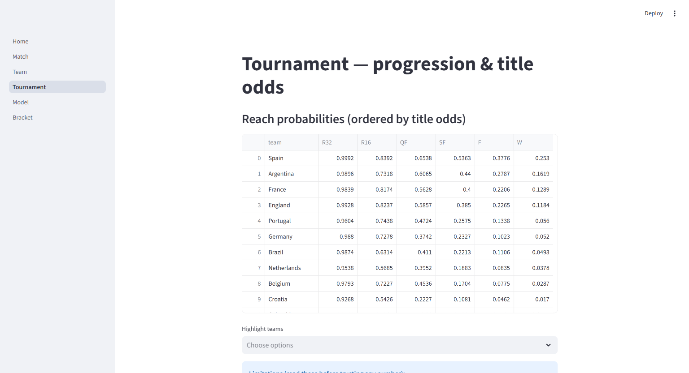
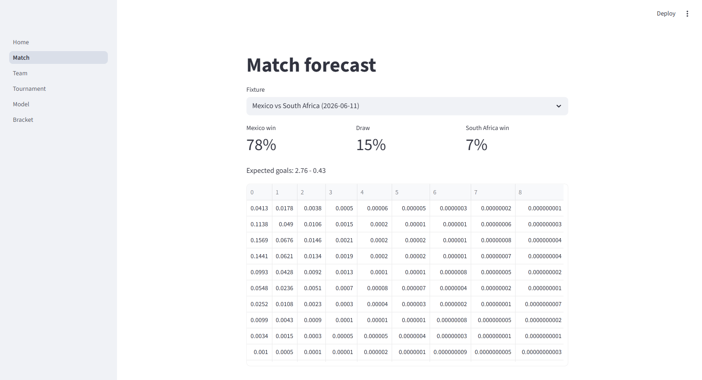
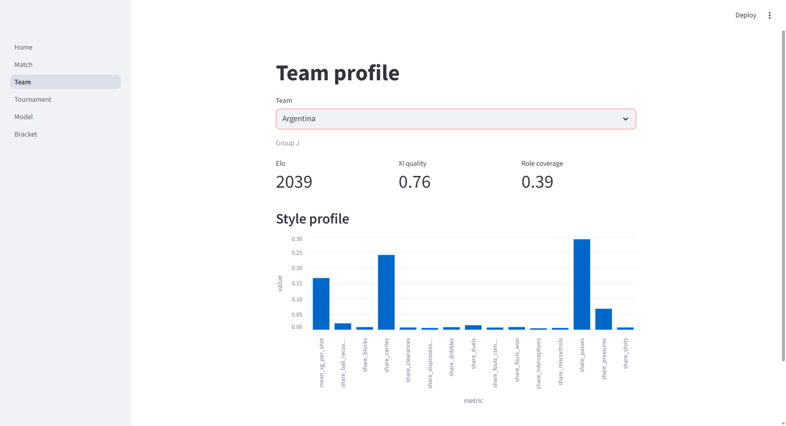
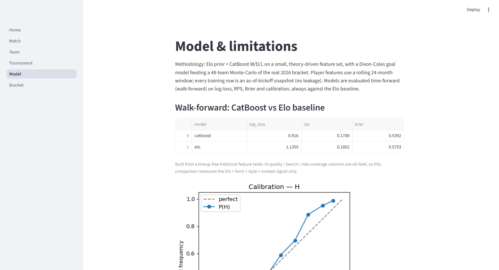
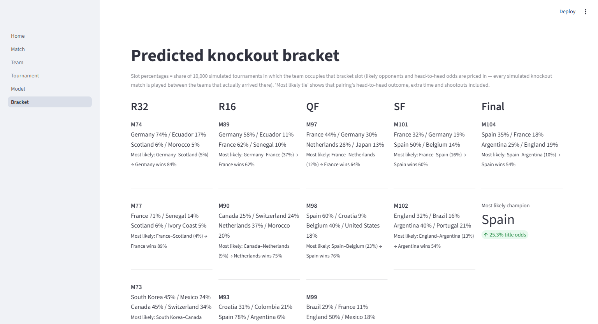
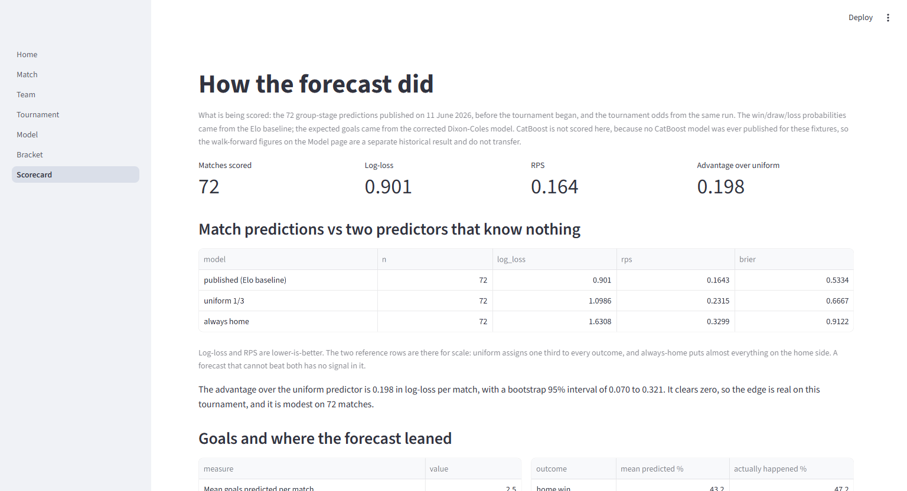

# World Cup 2026 forecast

What would happen if the 2026 World Cup were played ten thousand times? This project set out to
answer that before a ball was kicked. It rates every national team from 49,555 historical
matches, predicts each of the real group-stage fixtures, and then simulates the full 48-team
tournament ten thousand times to produce title odds with error bars. A read-only Streamlit
dashboard renders the results across six pages: per-match predictions, team profiles,
tournament odds, the model's own track record, a predicted knockout bracket, and a scorecard
of how the forecast actually did.

Everything below was produced on 11 June 2026, the day the tournament began, and has not been
edited since. That is the point. A forecast only means something if it was written down first,
so this one stays as it was published, warts included. The model's favorite was Spain at about
25%, ahead of Argentina and France.

The tournament has since finished, and the forecast has been scored against all 104 results.
It beat a no-knowledge baseline by a clear but modest margin, and its round-by-round
probabilities came out well calibrated. It was also wrong in specific, interesting ways.

## What it predicts

These were the title odds on the morning of the opening match, from a 10,000-run simulation. The
intervals are the Monte-Carlo sampling error: precise to a few tenths of a point at the top, and
wider in relative terms for the longshots.

| Team | P(win) | 95% interval |
|------|-------:|:------------:|
| Spain | 25.3% | 24.5 to 26.1% |
| Argentina | 16.2% | 15.5 to 16.9% |
| France | 12.9% | 12.2 to 13.6% |
| England | 11.8% | 11.2 to 12.5% |
| Portugal | 5.6% | 5.1 to 6.1% |
| Germany | 5.2% | 4.8 to 5.7% |
| Brazil | 4.9% | 4.5 to 5.4% |
| Netherlands | 3.8% | 3.4 to 4.2% |
| Belgium | 2.9% | 2.6 to 3.2% |
| Croatia | 1.7% | 1.5 to 2.0% |

The full table and the per-round reach probabilities live on the Tournament page.

## How it did

Scoring those 72 group-stage predictions against what actually happened:

| Predictor | Log-loss | RPS | Brier |
|-----------|---------:|----:|------:|
| The published forecast | 0.901 | 0.164 | 0.533 |
| Uniform, one third each | 1.099 | 0.231 | 0.667 |
| Always the home side | 1.631 | 0.330 | 0.912 |

Lower is better. The two reference rows are there for scale, because a log-loss of 0.9 means
nothing on its own.

The forecast beat the uniform predictor by 0.198 in log-loss per match, with a bootstrap 95%
interval of 0.070 to 0.321. That clears zero, so the edge is real on this tournament rather
than a lucky sample. It is also modest, and 72 matches is a modest sample, so that is as
strong as the claim gets.

The tournament-level probabilities held up better than the match-level ones. Across 240
team-and-round predictions, teams given 25 to 50% of reaching a round got there 42% of the
time, teams given 50 to 75% got there 75% of the time, and teams given more than 75% got
there 92% of the time. That is what calibration is supposed to look like.

Two things it got wrong. It expected about half a goal per match fewer than were scored, and
it under-predicted draws, 23.7% against the 27.8% that happened. Those two do not obviously
share a cause, and one tournament cannot settle it.

Spain won, and Spain was the model's favorite at 25.3%. Argentina, its second pick, were
runners-up. That is one observation and it is worth very little on its own: something given
25% happens about a quarter of the time, so a single correct call is not evidence of skill.
The 72 match predictions above are.

The full accounting, including every match ordered by how badly the model missed it, is in
[`reports/forecast_scorecard.md`](reports/forecast_scorecard.md) and on the Scorecard page of
the dashboard.

## The dashboard

The dashboard is read-only over the persisted tables. It has six pages.

The Tournament page ranks every team by title odds and shows how far each is expected to get.



The Match page gives win/draw/loss and a full scoreline grid for any fixture. Here Mexico are
heavy favorites over South Africa, with expected goals of 2.76 to 0.43.



The Team page profiles each of the 48 squads: Elo, a squad-quality score, and a playing-style
fingerprint for the teams StatsBomb covers.



The Model page is where the project keeps itself honest. It shows the walk-forward scores
against the Elo baseline and the calibration curve.



The Bracket page renders the official knockout tree, with each slot's occupancy probability and
the most likely matchup at every tie.



The Scorecard page marks the forecast against the results, with the reference predictors next
to it and every match ordered by how badly it was missed.



## How it works

The forecast is built from four parts that each do one job.

**Elo ratings** give every team a single strength number, updated match by match across the
full history. This is the backbone, and it is also the baseline that everything else has to beat.

**A CatBoost classifier** predicts win, draw, or loss for one match from a small set of features:
the Elo gap, recent form, rest days, and home advantage. The feature set is kept small on
purpose. International football produces only a few hundred meaningful matches a year, so a large
model would mostly memorize noise.

**A Dixon-Coles goal model** turns team strengths into a full scoreline distribution, the
probability of 2-1, 0-0, and every other result. That is what the simulator needs to actually
play a match rather than just label it.

**A Monte-Carlo simulator** plays the real 2026 bracket ten thousand times. It samples goals from
the Dixon-Coles model, applies the FIFA tie-breakers in the groups, and settles drawn knockouts
with a goal-model extra time and then a coin-flip shootout. Counting how often each team reaches
each round produces the odds and the intervals above.

Two corrections sit between the goal model and the simulator, and they carry a lot of the weight.

The first is an **Elo anchor**. It pulls each team's goal-scoring strength toward what its Elo
rating implies. Without it, teams that pile up goals against weak regional opponents look
stronger than they really are. France is the clean example: 10th on raw scoring records but 3rd
on Elo. The anchor corrects that cross-confederation distortion, which a goal-only model cannot
see on its own.

The second is a **squad bump**. It adds a measure of current squad talent, built from club-level
form and weighted by the strength of each player's league, so a country fielding a deep roster of
top-league players is rated above one that is not. This was the one input chosen on judgment
rather than backtest, because the player data only goes back to 2024 and cannot be tested against
older tournaments. The weight was set deliberately and documented rather than tuned to make the
odds look nice.

## The data behind it

| Table | Rows | Where it comes from |
|-------|-----:|---------------------|
| Historical matches | 49,555 | Kaggle (martj42) plus StatsBomb open data |
| Team Elo ratings | 98,794 | computed from results, 363 teams, up to June 2026 |
| Player stats | 597,165 | FBref, ~20K players across 630 clubs and 30+ leagues |
| Player event values | 21,618 | StatsBomb events from 262 internationals |
| Team style profiles | 885 | action-type shares for 59 national teams |
| 2026 fixtures | 72 | the real post-draw schedule, validated |
| 2026 groups | 48 | the actual draw |
| Predicted lineups | 2,910 | projected starting elevens for all 48 teams |

These counts describe the snapshot the forecast was built on, as of 11 June 2026. The upstream
sources keep growing, so rebuilding today yields a few hundred more matches and a few more
player rows. That is expected. The forecast is not rebuilt, because the whole point of it is
that it predates the tournament.

Raw datasets are not redistributed. The processed tables are reproducible from the ingestion and
modeling scripts, and a handful of small reference files (confederations, league strengths, club
to league maps) are committed directly.

## Does it actually work?

The honest answer is: better than the baseline, roughly calibrated, and not something to bet the
house on. Tested walk-forward, meaning the model only ever trains on the past and predicts the
future, the CatBoost model beats an Elo-only baseline on every metric.

| Model | Log-loss | RPS | Brier |
|-------|---------:|----:|------:|
| CatBoost | 0.916 | 0.179 | 0.539 |
| Elo baseline | 1.136 | 0.180 | 0.575 |

The gap is clear on log-loss but thin on RPS, and that is the point worth sitting with. A plain
Elo rating is genuinely hard to beat on international football, so the goal here is to approach
good calibration, not to claim an edge over the betting market. The test set is small, so I avoid
strong significance claims, and the feature importances describe the model rather than prove
causation.

## Honest limitations

Read these before trusting any number.

- International history is small, a few hundred matches a year. Intervals are wide and the
  project does not oversell them.
- The Elo baseline is the bar. Success is framed as approaching calibration, not beating the
  market, and the test set is too small for strong significance claims.
- Predicted lineups are the largest source of uncertainty. They are modeled as a distribution and
  carried through the simulation rather than fixed to one guessed eleven.
- The 48-team format is new, so the tournament structure is out of distribution. The model leans
  on team strength rather than format-specific priors.
- Club performance does not transfer cleanly to international play, so that signal is
  down-weighted, and any feature that could leak the result is used only in its pre-match form.
- In-tournament updates are coarse by design: Elo, lineups, and summary stats, not event-level.
  A run recomputes the goal model and the simulation, and reuses the CatBoost model.

The full writeup is in [`reports/methodology.md`](reports/methodology.md), and the
reasoning behind every parameter is in [`docs/design.md`](docs/design.md).

## A note on data correctness

Early on, an audit caught that the auto-generated tournament draw was wrong. Two teams were in the
wrong groups, four host fixtures had home and away flipped, and a misconfigured host name silently
matched no team at all. None of this broke anything loudly, which is exactly why it was dangerous.

The fix changed how the project treats generated data. Structural tables are now rebuilt from the
authoritative post-draw schedule and validated with hard checks on match counts, group pairings,
and canonical team names, not just checked for internal consistency. Any odds report produced
before that fix used the bad draw and should be ignored.

## Run it yourself

Install it as an editable package, which also puts `src` on the import path:

```bash
python -m pip install -e ".[dashboard]"    # core model plus Streamlit, CatBoost, matplotlib
python -m pytest -q                        # full test suite, 236 tests
python -m streamlit run app/Home.py        # dashboard at http://localhost:8501
```

`pip install -e .` on its own gets you the model and the test suite without the dashboard
stack. Add `".[ingest]"` if you want to refetch raw data.

The dashboard reads the persisted parquet tables, which are not in the repo because they
are reproducible. To regenerate them:

```bash
python scripts/ingest/regenerate_fixtures.py     # rebuild fixtures and groups from the schedule
python scripts/pipeline/run_simulation.py        # refit and run the 10k Monte-Carlo, about 3 min
python scripts/pipeline/build_dashboard_data.py  # per-fixture predictions, about 2 to 3 min
```

Careful with those last two. They regenerate the forecast, and the forecast in this repo is
only worth anything because it was made before the tournament. Rerunning them now would
overwrite a genuine out-of-sample prediction with a hindsight one.

The scorecard is built separately and reads only:

```bash
python scripts/ingest/fetch_2026_results.py      # scrape the 104 real results from Wikipedia
python scripts/pipeline/score_forecast.py        # score the frozen forecast against them
```

One command fetches new results and reruns the whole update cycle. This is the piece that was
built for the tournament and never actually used during it:

```bash
APIFOOTBALL_KEY=... python scripts/pipeline/run_live_cycle.py    # fetch plus full update, 4 to 5 min
```

Without an API key, update the match table by hand and pass `--no-fetch`.

Development happens on Windows, so the equivalent there is `$env:APIFOOTBALL_KEY = "..."`
before the command.

## Under the hood

The architecture, the parameter choices and the evidence behind each of them are written
up in [`docs/design.md`](docs/design.md), along with the known approximations and the
data-correctness rule that came out of the audit above.

The stack is Python throughout: pandas and NumPy for the data, SciPy for the Dixon-Coles
maximum-likelihood fit, CatBoost for the win/draw/loss classifier, and Streamlit for the
dashboard. The 236-test suite covers the pure transforms and the presenters. Scripts live
under `scripts/` in three folders: `ingest/` builds the input tables, `calibration/` holds
the parameter-selection experiments, and `pipeline/` holds the things you actually run.

The development machine is Windows on ARM64, which blocks a couple of x64-only football
libraries. Only the optional socceraction tier needs them; see
[`docs/arm64-and-codespaces.md`](docs/arm64-and-codespaces.md) for the workaround.
